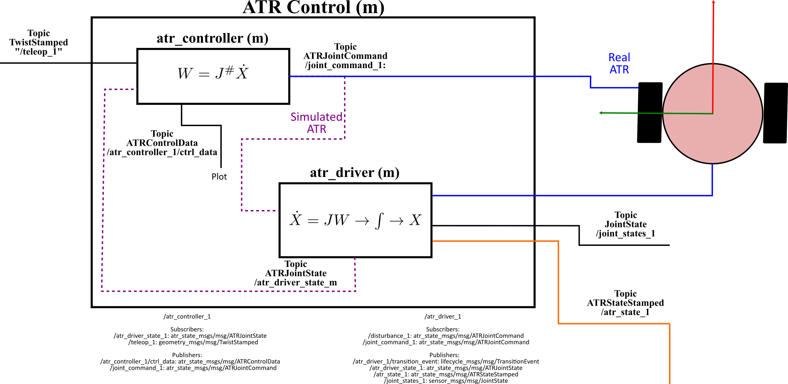

# atr_controller (Vanilla)

This repo contains the ros2 package with the ATR controller libraries and nodes

## Dependencies

The dependencies of this package are listed in the  package file (<https://gitlab.com/volvo_gto/gpss_mvp/control/atr_controller/-/blob/vanilla/package.xml>)

## Description

---

This package provides the kinematic control for the ATR. Together with the atr_driver forms the ATR's Low-level control system. The communication interface of the node provided by this package and the other nodes is depicted in the following figure:

The main task of this node is to transform Twist commands into wheel velocity commands. The Twist commands represent the ATR's 3DOF velocity relative to the world coordinate frame (wcf), i.e. the desired linear velocities (x and y) and angular velocity (z) of the ATR in the wcf. These wheel velocity commands will be connected to the atr_driver (<https://gitlab.com/volvo_gto/gpss_mvp/control/atr_driver/-/tree/vanilla>) to publish the atr_state and visualize the ATR in rviz.

### Input

The input of this node is the desired Twist velocity for the ATR as **geometry_msgs/TwistStamped** message.

### Output

This node produces two outputs:

1. The wheel velocity commands as an **ATRJointCommand** message (<https://gitlab.com/volvo_gto/gpss_mvp/shared/gpss_interfaces/atr_state_msgs/-/blob/vanilla/msg/ATRJointCommand.msg>)

2. The internal control data for tunning purposes. This data is published as **ATRControlData** message (<https://gitlab.com/volvo_gto/gpss_mvp/shared/gpss_interfaces/atr_state_msgs/-/blob/vanilla/msg/ATRControlData.msg>)

### Common methods

The controller implemented in the node is a simple kinematic controller of the form: $`W=J^{\#}\dot{X}`$. Where $`W\in \mathbb{R}^{2\times1}`$ repesents the left and right wheel velocities, $`J\in \mathbb{R}^{2\times3}`$ is the ATR jacobian matrix which maps the 3DOF velocities of the ATR, and $`\dot{X}\in \mathbb{R}^{3\times1}`$ is the 2D linear and 1D angular velocities of the ATR relative to the wcf. The node implements a closed-form analytic solution of the pseudo-inverse of $`J`$.

To minimize error drifting, we use $`\dot{X}=K_p\Delta X+K_d\Delta \dot{X}`$, where $`K_p, K_d \in \mathbb{R}^{3\times 3}`$ are diagonal proportional and derivative gain matrices, respectively. $`\Delta X=X_d-X, \Delta \dot{X}=\dot{X}_d-\dot{X}\in\mathbb{R}^{3\times 1}`$ are the position and velocty errors. $`X_d`$ is the estimated position of the ATR given a desired $`\dot{X}_d`$.

The controller paramters are defined by the config file: <https://gitlab.com/volvo_gto/gpss_mvp/control/atr_demo/-/blob/vanilla/config/atr_demo.param.yaml>

### Configuration file

This package uses an external configuration file:

<https://gitlab.com/volvo_gto/gpss_mvp/control/atr_demo/-/blob/vanilla/config/atr_demo.param.yaml>

## How to use

---

The best way to test this node is using the launch files provided by the ros2 package atr_demo <https://gitlab.com/volvo_gto/gpss_mvp/control/atr_demo/-/tree/vanilla>

## TODO

---

For the moment, this node only communicates with the atr_driver. This means, a simulated ATR. This ros package will be ported and upgraded to include communication to the ATR hardware (atr_controller_hw).

Include the 2DOF pose as input for the controller to avoid drifting
