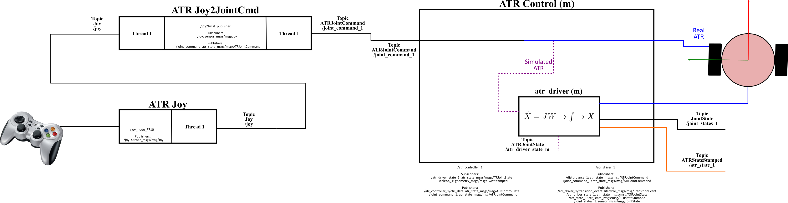
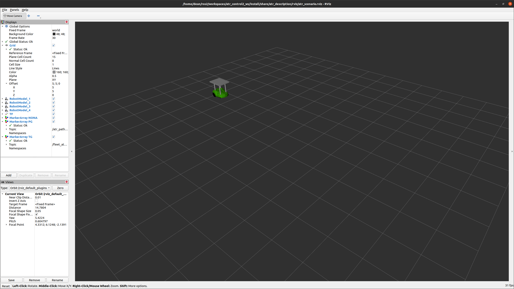
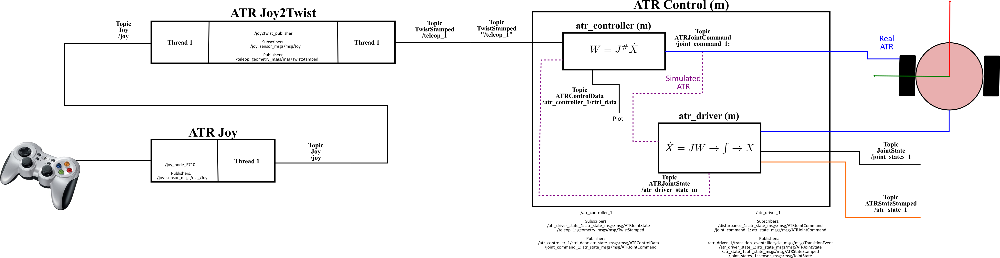
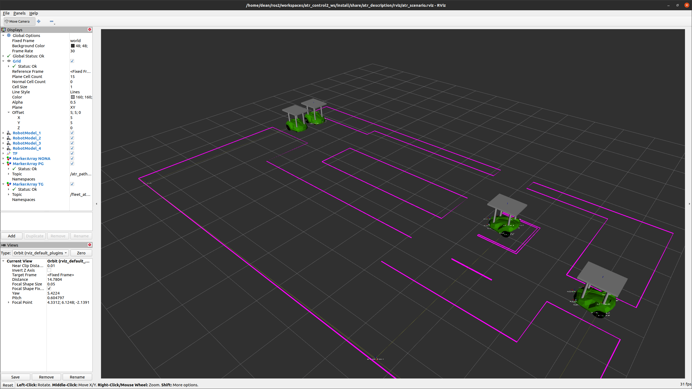
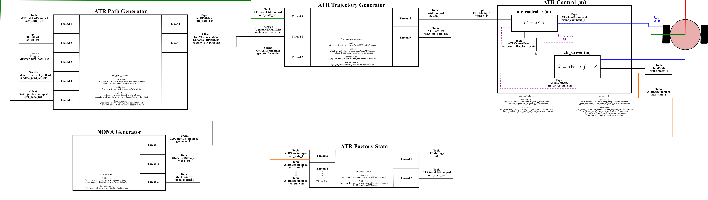
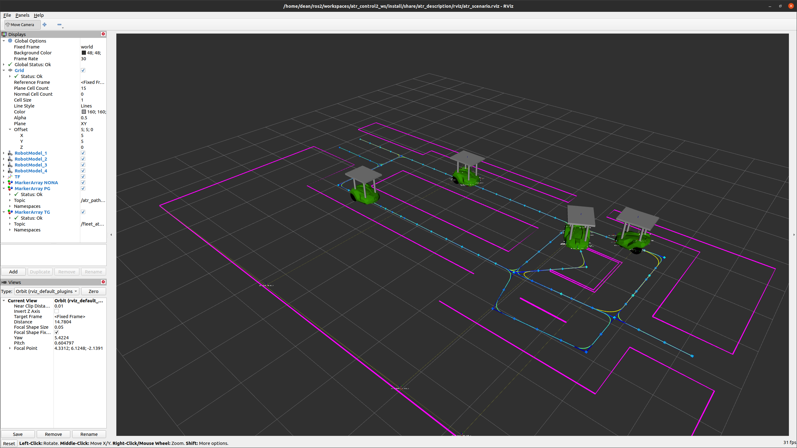
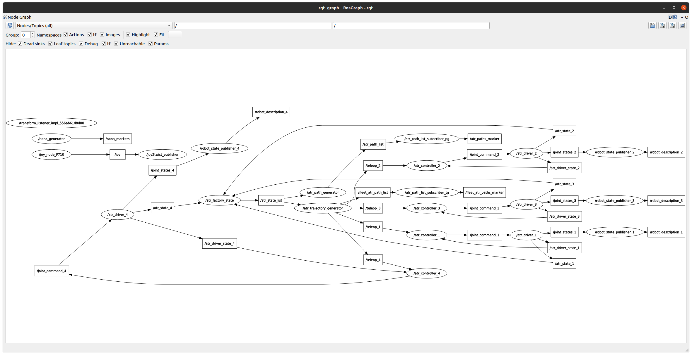

# atr_demo (Vanilla)

This repo contains a ros2 package with the simulated ATR Demos. This ros package provides different launch files to run a demo with the ATR controller, driver, trajectory generation, nona_generator, joystick, and visualization in Rviz.

## Dependencies

---

The dependencies of this package are listed in the  package file (<https://gitlab.com/volvo_gto/gpss_mvp/control/atr_demo/-/blob/vanilla/package.xml>)

### Python

This package requires a YAML parser for the launch files.

```bash
pip install PyYAML
```

You can use the workspace <https://gitlab.com/volvo_gto/gpss_mvp/workspaces/atr_demo_vanilla_ws> as an example of a functional system.

## Description

---

This package provides three different demos:

### Simple demo with Wheel Velocity Control

In this demo, the joystick will be used to control the wheel velocities of a single ATR. To know how to use the joystick see <https://gitlab.com/volvo_gto/gpss_mvp/control/atr_joy/-/blob/vanilla/README.md>, using the **Joy2JointCMD** node.

The joystick commands will be transformed into **JointCommands** which will be connected to the **atr_drive** to compute the new ATR state and shown in rviz. The communication interface of this demo is depicted in the following figure:



In this case, the wheel velocities are directly passed to the atr_driver without using a controller. This means, we are simulated the controller with the joystick.

To run this demo follow this instructions:

We assume **a)** that you have already installed our GitTools (<https://gitlab.com/volvo_gto/gpss_mvp/shared/tools/gittools>), **b)** you have configured your SSH-Key in Gitlab.

Open a new terminal (CTRL+ALT+T)

```bash
sudo apt install ros-galactic-xacro ros-galactic-joy nlohmann-json3-dev
gitclone git@gitlab.com:volvo_gto/gpss_mvp/workspaces/atr_control_ws.git
cd atr_control_ws/
gitsiniupco
source /opt/ros/galactic/setup.bash
colcon build  --symlink-install --merge-install --cmake-args -DCMAKE_EXPORT_COMPILE_COMMANDS=1
```

Then, open a new terminal and execute these commands:

```bash
cd atr_control_ws/
source install/setup.bash
ros2 launch atr_demo atr_driver_bringup.launch.py
```

You should see an ATR in rviz similar to this:



Now, use the left and right joystick sticks to command the ATR's wheels!

### Multiple ATRs demo with Twist Velocity Control

In this demo, we will use the joystick to generate the desired Twist ATR's velocity. This velocity will be used in a kinematic control to generate the wheel commands which will be sent to the atr_driver to generate the ATR state and visualize it in rviz. The launch file will spawn four ATRs but only one will be controlled with the joystick.

The architecture of communication of this demo is shown in the following figure:



In this case, the joystick is used to generate the trajectory that the ATR should follow.

Assuming that you have already run the previous demo and installed the workspace and the dependencies, you just need to execute this commands:

```bash
cd atr_control_ws/
source install/setup.bash
ros2 launch atr_demo atr_scenario.launch.py joy_twist:=True joy_topic:=teleop_1
```

You should see something similar to this:



Now, you can use the joystick to control the linear and angular velocities of the ATR. The velocities are relative to the ATR's base frame and not to the world coordinate frame. This means, x(+) is always a forward motion.

**IMPORTANT NOTE 1**: The ATR number and their IDs are defined in a global configuration file found in the factory_db package (<https://gitlab.com/volvo_gto/gpss_mvp/shared/factory_db/-/blob/vanilla/config/atr/atr.param.yaml>)

**IMPORTANT NOTE2:** The parameter atr_id_list defined in the package factory_db should match the number of ATRs (atr_driver and atr_controller) and their IDs defined in the atr_demo configuration file: <https://gitlab.com/volvo_gto/gpss_mvp/control/atr_demo/-/tree/vanilla/config/atr_demo.param.yaml>.

### Multiple ATRs demo with Path and Trajectory generators

In this final demo, we will run all the ATR nodes. This is the full-demo where paths navigating in the factory plan are generated and transformed into trajectories which are later published as Twist commands to control multiple ATRs.

The architecture is depicted in the following figure:



Again, assuming you have already run the above demos, execute these commands:

#### **Terminal 1**

```bash
cd atr_control_ws/
source install/setup.bash
ros2 launch atr_demo atr_scenario_path.launch.py joy_twist:=True
```

You should see something similar to this:


#### **Terminal 2**

```bash
cd atr_control_ws/
source install/setup.bash
ros2 service call /trigger_new_path_list std_srvs/srv/Trigger
```

Now, you should see the paths and the trajectories. All the ATRs will start following their corresponding trajectories, similar to this:



**IMPORTANT NOTE 1**: The ATR number and their IDs are defined in a global configuration file found in the factory_db package (<https://gitlab.com/volvo_gto/gpss_mvp/shared/factory_db/-/blob/vanilla/config/atr/atr.param.yaml>)

**IMPORTANT NOTE 2:** The parameter atr_id_list defined in the package factory_db should match the number of ATRs (atr_driver and atr_controller) and their IDs defined in the atr_demo configuration file: <https://gitlab.com/volvo_gto/gpss_mvp/control/atr_demo/-/tree/vanilla/config/atr_demo.param.yaml>.

The ros node graph of this demo looks like this:



## ROS Packages

Detailed information of the ros packages used in these demos can be found in the READMe file of each package:

atr_controller: <https://gitlab.com/volvo_gto/gpss_mvp/control/atr_controller/-/tree/vanilla>

atr_description: <https://gitlab.com/volvo_gto/gpss_mvp/control/atr_description/-/tree/vanilla>

atr_driver: <https://gitlab.com/volvo_gto/gpss_mvp/control/atr_driver/-/tree/vanilla>

atr_factory_state: <https://gitlab.com/volvo_gto/gpss_mvp/control/atr_factory_state/-/tree/vanilla>

atr_description: <https://gitlab.com/volvo_gto/gpss_mvp/control/atr_description/-/tree/vanilla>

atr_joy: <https://gitlab.com/volvo_gto/gpss_mvp/control/atr_joy/-/tree/vanilla>

atr_nona: <https://gitlab.com/volvo_gto/gpss_mvp/control/atr_nona/-/tree/vanilla>

atr_path_generator: <https://gitlab.com/volvo_gto/gpss_mvp/control/atr_path_generator/-/tree/vanilla>

atr_trajectory_generator: <https://gitlab.com/volvo_gto/gpss_mvp/control/atr_trajectory_generator/-/tree/vanilla>

atr_utils: <https://gitlab.com/volvo_gto/gpss_mvp/control/atr_utils/-/tree/vanilla>
