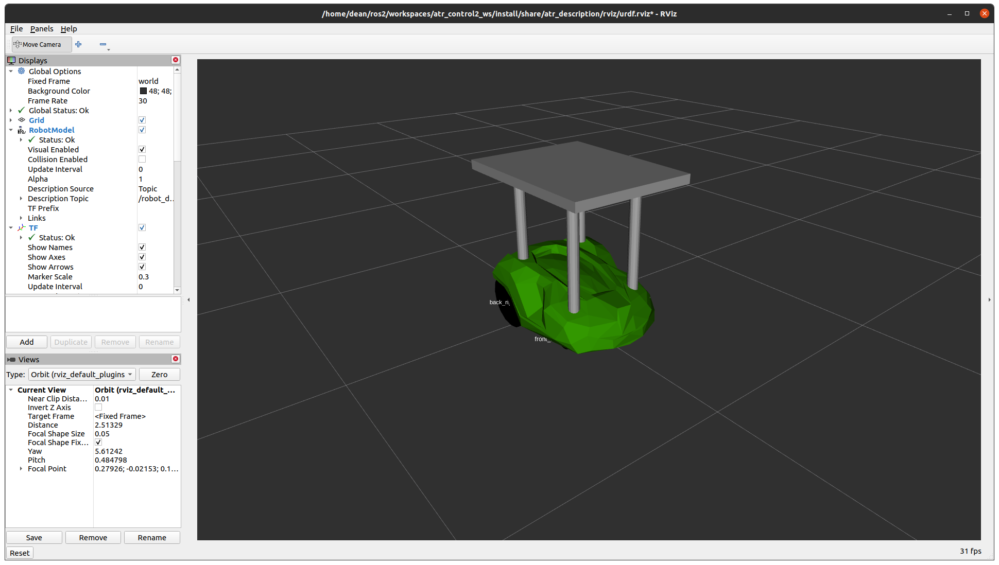
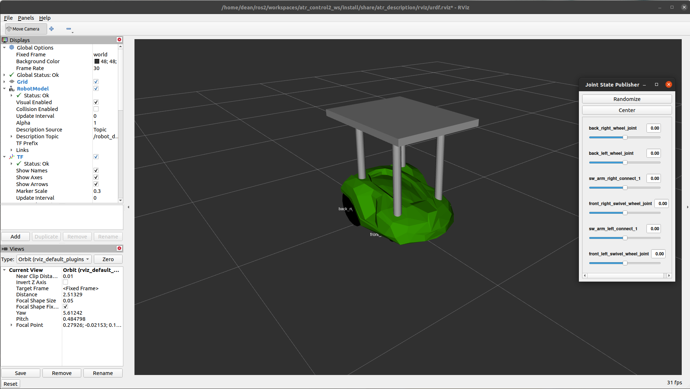
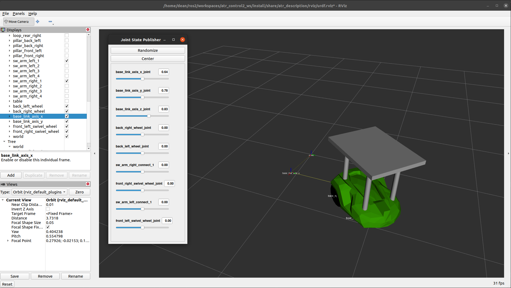
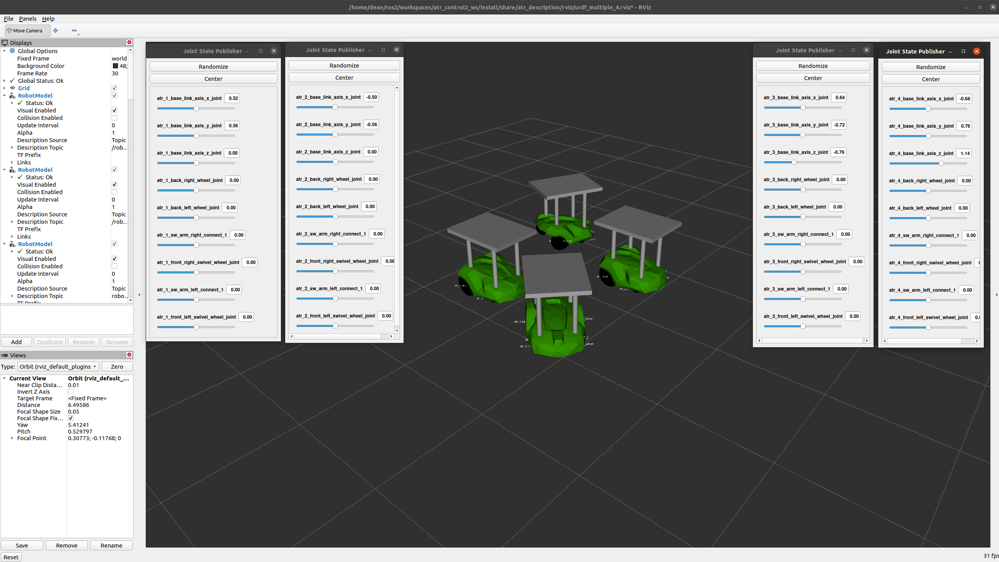

# atr_description (Vanilla)

This repo contains a ros2 package with the ATR description. It provides the URDF file and ros2-launch files to bring up the ATR robot and visualize it in Rviz.

The atr_description package provides two atr URDF models **atr_robot.urdf.xacro** and **atr_robot_base.urdf.xacro**.

## Dependencies

---

In addition to the dependencies listed in the  package file (<https://gitlab.com/volvo_gto/gpss_mvp/control/atr_description/-/blob/vanilla/package.xml>), this ros2 package uses the xacro ros package. In ubuntu 20.04 run the following command:

```bash
sudo apt install ros-galactic-xacro
```

## Description

---

### Type of models

The first is the atr without floating base, without considering the link between the world coordinate frame (wcf) and the robot's base. The second model includes a 3DOF (PPR) base to connect the wcf with the robot's base. The joints produced by the two models are:

#### **Actuated Joints (without base)**

Joint Names:

- back_right_wheel_joint
- back_left_wheel_joint
- sw_arm_right_connect_1
- front_right_swivel_wheel_joint
- sw_arm_left_connect_1
- front_left_swivel_wheel_joint

#### **Actuated Joints (with base)**

Joint Names:

- base_link_axis_x_joint
- base_link_axis_y_joint
- base_link_axis_z_joint
- back_right_wheel_joint
- back_left_wheel_joint
- sw_arm_right_connect_1
- front_right_swivel_wheel_joint
- sw_arm_left_connect_1
- front_left_swivel_wheel_joint

To define and control the odometry of the robot, we need to use the atr robot with the 3DOF base.

The models provided by this package are needed to create a **robot_description** which can be visualized in Rviz. This models can be spawned using the launch files provided in the **launch/** folder. In general, these launch files receive three parameters.

### Input

1. gui: Flag to enable joint_state_publisher_gui. If true, the launch will open a joint window where we can command the joint positions.

2. model: To define the absolute path to the xacro model

3. rvizconfig: Absolute path to rviz config file

### Output

The output is a **robot_description** and a **joint_state**. Depending on the selected launch file, it can be a single or multiple **robot_descriptions**.  

## How to use

---

### Launch files

There are three types of launch files defined by the postfixes '_nojoint' and '_multiple'.

1. _nojoint: This launch file doesn't provide the optional **joint gui**. These launch files are useful when the joint positions will be published by an external ros node, e.g. atr_driver node (<https://gitlab.com/volvo_gto/gpss_mvp/control/atr_driver/-/tree/vanilla>).

2. _multiple: This launch file provides the option to launch several ATRs. It will create multiple **robot_descriptions** where the ATR id will be used as part of the description name.

Open a terminal and source your workspace

```bash
cd ~/workspace
source install/setup.bash
```

#### Simple model (Without 3DOF base)

Without joint gui

```bash
ros2 launch atr_description atr_bringup.launch.py
```



With joint gui

```bash
ros2 launch atr_description atr_bringup.launch.py gui:=true
```



You should see a new window with slidebars to control the different joints on the ATR.

#### Simple model with 3DOF base

```bash
ros2 launch atr_description atr_base_bringup.launch.py gui:=true
```



In this case, you will notice that the joint gui provides three additional joints to move the robot base relative to the world coordinate frame.

#### Multiple ATRs

```bash
ros2 launch atr_description atr_base_bringup_multiple.launch.py gui:=true
```

In this case, you will notice four joint command windows that you can use to move the four ATRs in rviz.



This launch file will generate four **robot_descriptions**, e.g. /robot_description_1, ..., /robot_description_4. Each of them, will subscribe to a topic named '/joint_states_1', ... , 'joint_states_4'. When using the gui:=true flag a joint window will be opened. This joint command window will publish the joint positions.

## TODO

---

For now, the maximum number of ATR that can be visualized in rviz is limited to four. This is because you need to manually add a 'Robot Model' in Rviz. However, you can add as many robots as needed and modify the rviz window accordingly.
