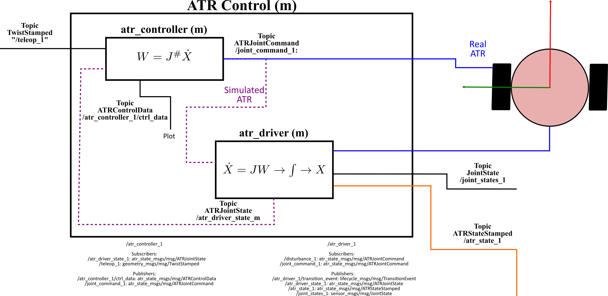

# atr_driver (Vanilla)

This repo contains a ros2 package with the ATR driver. It provides a kinematic model to run the ATR in simulation and in the real hardware.

## Dependencies

---

The dependencies of this package are listed in the  package file (<https://gitlab.com/volvo_gto/gpss_mvp/control/atr_driver/-/blob/vanilla/package.xml>)

## Description

---

This package provides the kinematic model to simulate the ATR. Together with the atr_controller forms the ATR's Low-level control system. The communication interface of the node provided by this package and the other nodes is depicted in the following figure:

The main task of this node is to transform wheel veloctity commands into ATR velocities and pose relative to the world coordinate frame (wcf), i.e. simualtes the ATR with a given control input. The wheel velocity commands can be generated by a controller (<https://gitlab.com/volvo_gto/gpss_mvp/control/atr_controller/-/tree/vanilla>) or by a joystick (<https://gitlab.com/volvo_gto/gpss_mvp/control/atr_joy/-/tree/vanilla>). This atr_driver publishes the atr_state and visualize the ATR in rviz.

### Input

The input of this node is the commanded wheel velocities for the ATR as **ATRJointCommand** message (<https://gitlab.com/volvo_gto/gpss_mvp/shared/gpss_interfaces/atr_state_msgs/-/blob/vanilla/msg/ATRJointCommand.msg>).

The driver has a service named "/reset_1" that reset the state of the ATR to the original one.

TODO: Modify the name of the reset service to be applicable when more than one ATR is running as well as have a more imformative name.

TODO: This node will also communicate with the hardware and get the odometry information from the ATR's encoders.

### Output

This node produces three/four(TODO) outputs:

1. The ATR's state (3DOF pose and velocity) as an **ATRJointState** message (<https://gitlab.com/volvo_gto/gpss_mvp/shared/gpss_interfaces/atr_state_msgs/-/blob/vanilla/msg/ATRJointState.msg>). This data will be used as a feedback information for the controller, and it is monitored with QoS.

2. The ATR's state as an **ATRStateStamped** message (<https://gitlab.com/volvo_gto/gpss_mvp/shared/gpss_interfaces/atr_state_msgs/-/blob/vanilla/msg/ATRStateStamped.msg>). This data will be used by the atr_factory_state (<https://gitlab.com/volvo_gto/gpss_mvp/control/atr_factory_state/-/tree/vanilla>) to create the list of ATR states needed by the other nodes.

3. The ATR's **JointState** message which is needed by the robot_description node to visualize the ATR in rviz.

4. TODO: Send the wheel commands to the ATR hardware.

### Common methods

The kinematic model implemented in the node is a simple kinematic model of the form: $`\dot{X}=JW`$. Where $`W\in \mathbb{R}^{2\times1}`$ repesents the left and right wheel velocities, $`J\in \mathbb{R}^{2\times3}`$ is the ATR jacobian matrix which maps the 3DOF velocities of the ATR, and $`\dot{X}\in \mathbb{R}^{3\times1}`$ is the 2D linear and 1D angular velocities of the ATR relative to the wcf. This kinematic model produces velocities which are integrated in time to produce the 2DOF ATR's pose. This means, the kinematic model uses initial conditions to generate the 2DOF pose. This initial state and other important parameters are defined in the configuration file (<https://gitlab.com/volvo_gto/gpss_mvp/control/atr_demo/-/blob/vanilla/config/atr_demo.param.yaml>)

### Configuration file

This package uses an external configuration file:

<https://gitlab.com/volvo_gto/gpss_mvp/control/atr_demo/-/blob/vanilla/config/atr_demo.param.yaml>

## How to use

---

The best way to test this node is using the launch files provided by the ros2 package atr_demo <https://gitlab.com/volvo_gto/gpss_mvp/control/atr_demo/-/tree/vanilla>

## TODO

---

For the moment, this node only provides a simulation for the ATR. This ros package will be ported and upgraded to include communication to the ATR hardware (atr_driver_hw).
