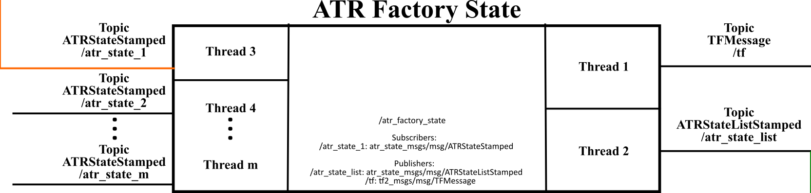

# atr_factory_state (Vanilla)

This repo contains the ros2 package with the ATR factory state module. It provides a ros2 node to collect all the information of the factory state.

## Dependencies

The dependencies of this package are listed in the  package file (<https://gitlab.com/volvo_gto/gpss_mvp/control/atr_factory_state/-/blob/vanilla/package.xml>)

## Description

---

This package provides a factory state node. The communication interface of the node provided by this package and the other nodes is depicted in the following figure:

The main task of this node is to collect the data generated by the other nodes in the architecture and generate a common message. In other words, this node provides an interface for all the data generated in the mvp system. For the moment, this module only receives the ATR states and creates a List of ATR States. The node will dynamically create the publishers to subscribe to each of the ATR state messages provided by the atr_driver (<https://gitlab.com/volvo_gto/gpss_mvp/control/atr_driver>).

**IMPORTANT NOTE 1**: The ATR number and their IDs are defined in a global configuration file found in the factory_db package (<https://gitlab.com/volvo_gto/gpss_mvp/shared/factory_db/-/blob/vanilla/config/atr/atr.param.yaml>)

**IMPORTANT NOTE 2:** The parameter atr_id_list defined in the package factory_db should match the number of ATRs (atr_driver and atr_controller) and their IDs defined in the atr_demo configuration file: <https://gitlab.com/volvo_gto/gpss_mvp/control/atr_demo/-/tree/vanilla/config/atr_demo.param.yaml>.

### Input

The input of this node is all the ATR states in the from of **ATRStateStamped** message (<https://gitlab.com/volvo_gto/gpss_mvp/shared/gpss_interfaces/atr_state_msgs/-/blob/vanilla/msg/ATRStateStamped.msg>).

### Output

This node produces the following outputs:

1. The states of all the active ATRs as a **ATRStateListStamped** message (<https://gitlab.com/volvo_gto/gpss_mvp/shared/gpss_interfaces/atr_state_msgs/-/blob/vanilla/msg/ATRStateListStamped.msg>)

2. TODO: The information of all the obstacles and humans in the scenario.

### Common methods

Simple message forwarding.

### Configuration file

<https://gitlab.com/volvo_gto/gpss_mvp/control/atr_factory_state/-/blob/vanilla/config/atr_factory_state.yaml>

## How to use

---

The best way to test this node is using the launch files provided by the ros2 package atr_demo <https://gitlab.com/volvo_gto/gpss_mvp/control/atr_demo/-/tree/vanilla>

## TODO

---

For the moment, this node is a simple message forwarding. We need to include information of all the agents present in the factory and perform signal filtering for some target signals.
