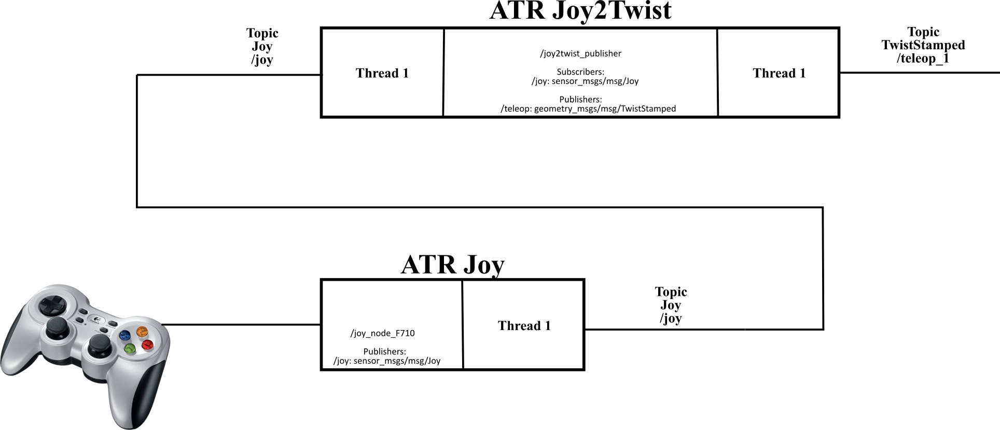
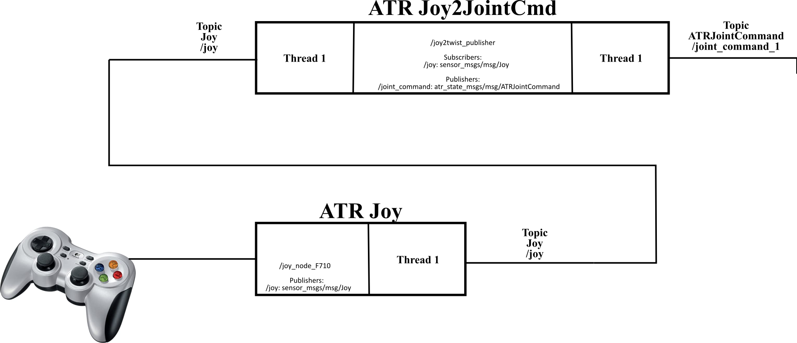
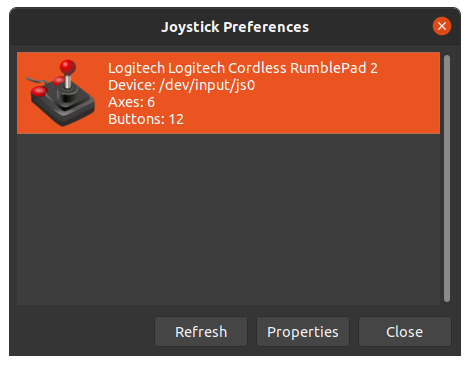
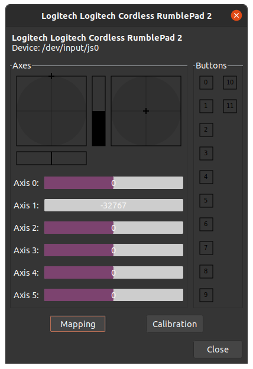

# atr_joy (Vanilla)

This repo contains the ros2 package with the ATR joy nodes. It provides nodes to connect joy messages from the ros2 joy package and transform them into wheel commands or twist messages to control the ATR robot.

## Dependencies

---

The dependencies of this package are listed in the  package file (<https://gitlab.com/volvo_gto/gpss_mvp/control/atr_joy/-/blob/vanilla/package.xml>)

Furthermore, you need to install the joy ros package needed by the launch files provided by this package.

```bash
sudo apt install ros-galactic-joy
```

## Description

---

This package provides two nodes to get information from a joystick and transform it into Twist velocities or Wheel velocity commands. These nodes will interface the messages generated by the joy node **sensor_msgs/msg/Joy** and transform them into Twist velocity commands **geometry_msgs/msg/TwistStamped** or Wheel velocity commands **ATRJointCommand** (<https://gitlab.com/volvo_gto/gpss_mvp/shared/gpss_interfaces/atr_state_msgs/-/blob/vanilla/msg/ATRJointCommand.msg>), depending on the selected node, either **Joy2Twist** or **Joy2JointCMD**.

The communication interfaces for both cases are depicted in the following figures:





The main task of this node is to transform wheel velocity commands into ATR velocities and pose relative to the world coordinate frame (wcf), i.e. simulates the ATR with a given control input. The wheel velocity commands can be generated by a controller (<https://gitlab.com/volvo_gto/gpss_mvp/control/atr_controller/-/tree/vanilla>) or by a joystick (<https://gitlab.com/volvo_gto/gpss_mvp/control/atr_joy/-/tree/vanilla>). This atr_driver publishes the atr_state and visualize the ATR in rviz.

### Input

The input of these nodes is the joystick data generated by the joy node as *sensor_msgs/msg/Joy** message.

### Output

This node produces two outputs:

1. Joy2Twist will transform the joy messages into Twist message **geometry_msgs/msg/TwistStamped**. The produced Twist message is relative to the ATR's base frame. This data will be used as the desired linear and angular velocities of the ATR generating the reference for a velocity controller.

2. Joy2JointCmd will transform the joy messages into **ATRJointCommand** (<https://gitlab.com/volvo_gto/gpss_mvp/shared/gpss_interfaces/atr_state_msgs/-/blob/vanilla/msg/ATRJointCommand.msg>). This data represent the wheel velocity commanded to the ATR. In this case, these wheel velocities can be received by the atr_driver (<https://gitlab.com/volvo_gto/gpss_mvp/control/atr_driver/-/tree/vanilla>) to produce the ATR state.

### Common methods

The nodes transform the joy stick motions and buttons into the selected message.

### Configuration file

This package uses two configuration files:

<https://gitlab.com/volvo_gto/gpss_mvp/control/atr_joy/-/blob/vanilla/config/atr_joy.yaml>

<https://gitlab.com/volvo_gto/gpss_mvp/control/atr_joy/-/blob/vanilla/config/atr_joy_jointcmd.yaml>

## How to use

---

### Check Joystick communication

The simplest way to check the communication with the Joystick is to use Ubuntu's tool jstest-gtk.

First, install the ubuntu package:

```bash
sudo apt install jstest-gtk
```

Then, run in a terminal:

```bash
jstest-gtk
```

You should see a window similar to this:



If you click on *Properties* you should see the different stick and button values when you interact with the joystick



Close the window when you are finished

### Running the ros node

To start publishing the joystick actions into the selected message, we need to keep pressed the 'security button' a.k.a.dead-man switch (<https://en.wikipedia.org/wiki/Dead_man%27s_switch>). This switch is the button **LB** in the joystick.

**NOTE**: We are using the joystick **Logitech F710** (<https://www.logitech.com/sv-se/product/f710-wireless-gamepad>). For other joystick models the key settings have to be re-configured.

Depending on the selected node, the joystick signals have different meaning:

### Joy2Twist

1. **Left_Stick** (up/down): linear velocity in x-axis (+/-)

2. **Left_Stick** (right/left): linear velocity in y-axis (+/-)

3. **Right_Stick** (right/left): angular velocity around z-axis (+/-)

Since the ATR is a sub-actuated system, i.e. 3DOF and two actuators. We can only command 2DOFs at the time. In our case, we command either the linear velocities (x and y), or the angular velocity (z). This produces combined Linear/Angular motion in the ATR for the first case, and pure rotation for the second case.

### Joy2JointCMD (Wheel velocities)

1. **Left_Stick** (up/down): left wheel angular velocity (+/-)

2. **Right_Stick** (up/down): right wheel angular velocity (+/-)

The best way to test this node is using the launch files provided by the ros2 package atr_demo <https://gitlab.com/volvo_gto/gpss_mvp/control/atr_demo/-/tree/vanilla>

## TODO

---

Nothing to do, for the moment ;)
