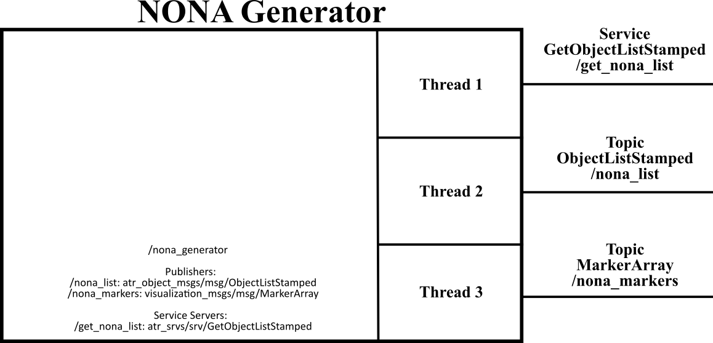

# atr_nona (Vanilla)

This repo contains the ros2 package with the ATR Non-Accessible Areas node. It provides a JSON parser and a publisher to visualize the NONA as MarkerArray messages.

## Dependencies

---

In addition to the dependencies listed in the  package file (<https://gitlab.com/volvo_gto/gpss_mvp/control/atr_nona/-/blob/vanilla/package.xml>), this ros2 package uses a JSON parser library. In ubuntu 20.04 run the following command:

```bash
sudo apt install nlohmann-json3-dev
```

If you need to install the library from source, follow the instructions from:

<https://github.com/nlohmann/json>

## Description

---

This package provides a node that advertise a service to get a list of all the non-accessible areas  (NONA) in the factory **GetObjectListStamped** (<https://gitlab.com/volvo_gto/gpss_mvp/shared/gpss_interfaces/atr_srvs/-/blob/vanilla/srv/GetObjectListStamped.srv>). This node also publishes the ObjecList as a topic and transforms the objects' polygons into an array of visualization markers to show them in Rviz.

The communication interface of this node is depicted in the following figure:



The main task of this node is to transform a list of objects, defined as polygons, into an **GetObjectListStamped** message and a **visualization_msgs/msg/MarkerArray** message. Furthermore, this node provides a service which can be used by client nodes to update the list of objects on demand.

### Input

The input of this node is a json file with the objects described as polygons. An example of such json file can be found in the config folder of this package (<https://gitlab.com/volvo_gto/gpss_mvp/control/atr_nona/-/blob/vanilla/config/nona_description.json>). Each vector in the polygon list represents the coordinates (x,y,z) of the polygon's nodes. In our case, we assume a 2D floor plan, then, the z coordinate is always set to zero.  

### Output

This node produces three outputs:

1. Service **GetObjectList** to request the updated information of the NONA objects (Synchronous communication).

2. A topic with the current **ObjectListStamped** (Asynchronous communication).

3. A topic with the polygons as **MarkerArray**. The topic name and other parameters are defined in the configuration file (<https://gitlab.com/volvo_gto/gpss_mvp/control/atr_nona/-/blob/vanilla/config/nona_generator.yaml>).

### Common methods

None

### Configuration file

This package uses two types of configuration files:

<https://gitlab.com/volvo_gto/gpss_mvp/control/atr_nona/-/blob/vanilla/config/nona_generator.yaml>

<https://gitlab.com/volvo_gto/gpss_mvp/control/atr_nona/-/blob/vanilla/config/nona_description.json>

## How to use

---

First, you need to define the coordinates of the polygons that will define the 2D floor plan of the factory. These polygons have to be defined in a json format, see (<https://gitlab.com/volvo_gto/gpss_mvp/control/atr_nona/-/blob/vanilla/config/nona_description.json>) for an example.

You can run the nona_generator in a stand-alone demo with the following commands:

```bash
cd to_ros2_workspace
source install/setup.bash
ros2 launch atr_nona atr_nona_test_launch.py
```

Also, the best way to test this node is using the launch files provided by the ros2 package atr_demo <https://gitlab.com/volvo_gto/gpss_mvp/control/atr_demo/-/tree/vanilla>

## TODO

---

Nothing to do, for the moment ;)
