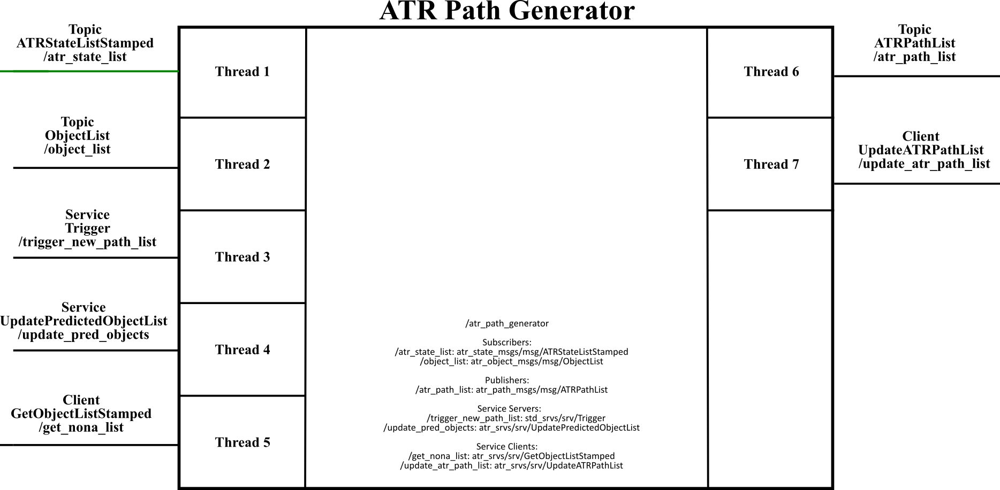

# atr_path_generator (Vanilla)

This repo contains the ros2 package with the ATR path generation. It provides nodes to receive job requests and generate discrete paths for the ATR robot, using the factory node descriptions from JSON files.

## Dependencies

---

The dependencies of this package are listed in the  package file (<https://gitlab.com/volvo_gto/gpss_mvp/control/atr_path_generator/-/blob/vanilla/package.xml>)

## Description

---

This package provides a node to generate a list of paths for the ATRs that can be used to generate trajectories. The node provides a client that request to a server **UpdateATRPathList** to update the local path list. In our case, the server is provided by the atr_trajectory_generator module (<https://gitlab.com/volvo_gto/gpss_mvp/control/atr_trajectory_generator/-/tree/vanilla>). The atr_path_generator also publishes the path list as a topic to visualize the paths in rviz.  

The communication interface of the node provided by this package and the other nodes is depicted in the following figure:



For the moment, this node uses hard-coded data defined in a JSON file. An example of this JSON file can be found in (<https://gitlab.com/volvo_gto/gpss_mvp/control/atr_path_generator/-/blob/vanilla/config/nodes_tuve.json>). The paths are defined by a set of nodes {id, 3D position, name, description} and a list of segments (graph) that define the path.

```json
{
    "Nodes": 
    [
        {"id": 1,  "position": [ 0.66, 5.09, 0.0], "name": "CharSt_1", "description": "Charging station located at the s-east"}, 
        {"id": 2,  "position": [ 0.66, 5.91, 0.0], "name": "CharSt_2", "description": "Charging station located at the s-east"},
        {"id": 3,  "position": [10.31, 6.06, 0.0], "name": "DelvSt_1", "description": "Delivering station located at the s-west"},
        {"id": 4,  "position": [11.69, 3.68, 0.0], "name": "CharSt_3", "description": "Charging station located at the n-west"},
        {"id": 5,  "position": [10.31, 2.61, 0.0], "name": "DelvSt_2", "description": "Delivering station located at the n-west"}
    ],
    "Paths": 
    [ 
        {"id": 1, "graph": [1, 3, 4, 2, 1]},
        {"id": 2, "graph": [4, 5, 3, 1, 2]},
    ]
}
```

The position of each node is relative to the world coordinate frame (wcf).  This frame is defined in the configuration file: (<https://gitlab.com/volvo_gto/gpss_mvp/control/atr_path_generator/-/blob/vanilla/config/atr_path_generator.yaml>)

IMPORTANT!
The node has been modified to enable an ATR to have a random path from Paths selected independent of id. 

### Input

This node has several inputs:

1. A list of ATR states **ATRStateListStamped**, usually provided by the atr_factory_state module (<https://gitlab.com/volvo_gto/gpss_mvp/control/atr_factory_state/-/tree/vanilla>). This ATR state list is needed to generate the paths using the current pose of each ATR.

1. A Client to request the updated list of non-accessible areas (NONA) **GetObjectListStamped** (<https://gitlab.com/volvo_gto/gpss_mvp/shared/gpss_interfaces/atr_srvs/-/tree/vanilla/srv/GetObjectListStamped.srv>)

1. A service to send the generated path list to the trajectory server **std_srvs/srv/Trigger**. We can control when the path list should be updated and sent to the recipient server, e.g. atr_trajectory_generator <https://gitlab.com/volvo_gto/gpss_mvp/control/atr_trajectory_generator/-/tree/vanilla>).

1. [Not used for the moment] A list of Objects **ObjectList**. It can be generated by the perception modules

1. [Not used for the moment] A service to receive the updated list of predicted objects **UpdatePredictedObjectList** (<https://gitlab.com/volvo_gto/gpss_mvp/shared/gpss_interfaces/atr_srvs/-/tree/vanilla/srv/UpdatePredictedObjectList.srv>)

### Output

This node produces two outputs:

1. The generated atr path list as a topic **ATRPathList** (<https://gitlab.com/volvo_gto/gpss_mvp/shared/gpss_interfaces/atr_path_msgs/-/blob/vanilla/msg/ATRPathList.msg>). This topic is used to visualize the atr paths in rviz, see (<https://gitlab.com/volvo_gto/gpss_mvp/control/atr_path_generator/-/tree/vanilla/src/Applications/path_list_subscriber_node.cpp>). Each path in the generated list will provide an ordered list of nodes and the target ATR (atr_id).  

1. A Client to a service **UpdateATRPathList** (<https://gitlab.com/volvo_gto/gpss_mvp/shared/gpss_interfaces/atr_srvs/-/tree/vanilla/srv/UpdateATRPathList.srv>). This client will use the generated path list as a request data to a server which requires this information, e.g. atr_trajectory_generator <https://gitlab.com/volvo_gto/gpss_mvp/control/atr_trajectory_generator/-/tree/vanilla>).

### Common methods

For the moment, a path is a simple graph description with nodes and segments connecting the nodes.

### Configuration file

This package uses two types of configuration files:

<https://gitlab.com/volvo_gto/gpss_mvp/control/atr_path_generator/-/blob/vanilla/config/atr_path_generator.yaml>

<https://gitlab.com/volvo_gto/gpss_mvp/control/atr_path_generator/-/blob/vanilla/config/atr_path_list_subs.yaml>

<https://gitlab.com/volvo_gto/gpss_mvp/control/atr_path_generator/-/blob/vanilla/config/nodes_tuve.json>

## How to use

---

The best way to test this node is using the launch files provided by the ros2 package atr_demo <https://gitlab.com/volvo_gto/gpss_mvp/control/atr_demo/-/tree/vanilla>

## TODO

---

Change the service **UpdateATRPathList** to use **ATRPathListStamped** instead of **ATRPathList** since we need to define the frame_id.

For the moment, this node only provides hard-coded paths. This ros package will be upgraded to generate the paths based on the factory description and a dynamic path generator, e.g. A*.

The ATR picking a path at random is not suitable when more than one ATR is running or when the ATR is not training. 