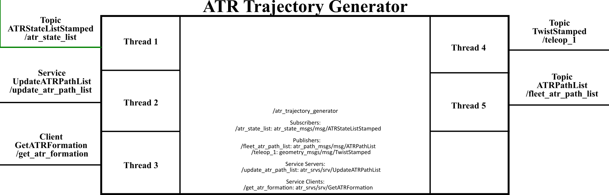

# atr_trajectory_generator (Vanilla)

This repo contains the ros2 package with the ATR trajectory generator. It provides a ros node to transform ATR paths into trajectories and generate the commanded twist messages for the ATR controller.

## Dependencies

---

The dependencies of this package are listed in the  package file (<https://gitlab.com/volvo_gto/gpss_mvp/control/atr_trajectory_generator/-/blob/vanilla/package.xml>)

## Description

---

This package provides a node to generate 2D pose trajectories for each ATR based on a path usually generated by path generator, e.g. atr_path_generator (<https://gitlab.com/volvo_gto/gpss_mvp/control/atr_path_generator/-/tree/vanilla>). These trajectories are transformed into ATR velocity commands and published as a twist message **geometry_msgs/msg/TwistStamped**.

The communication interface of the node provided by this package and the other nodes is depicted in the following figure:

This node uses the atr_id contained in each path description to generate a publisher for each ATR.

### Input

This node has three inputs:

1. A list of ATR states **ATRStateListStamped**, usually provided by the atr_factory_state module (<https://gitlab.com/volvo_gto/gpss_mvp/control/atr_factory_state/-/tree/vanilla>). This ATR state list is needed to generate the trajectories using the current pose of each ATR.

1. A Service to receive a list of target atr paths **UpdateATRPathList** (<https://gitlab.com/volvo_gto/gpss_mvp/shared/gpss_interfaces/atr_srvs/-/tree/vanilla/srv/UpdateATRPathList.srv>). This path list is provided by a path generator, e.g. atr_path_generator (<https://gitlab.com/volvo_gto/gpss_mvp/control/atr_path_generator/-/tree/vanilla>). This node will dynamically create the needed publishers using the atr_id as a part of the topic name. If the publisher has been already created the node will only update the trajectory with the new path information (without creating a new publisher).

1. [Not used for the moment] A client to get The atr formation **GetATRFormation**. This formation list defines which ATRs are in formation, i.e. their relative pose is constrained to one or more ATRs.

### Output

This node produces two outputs:

1. The generated trajectories list as a topic **ATRPathList** (<https://gitlab.com/volvo_gto/gpss_mvp/shared/gpss_interfaces/atr_path_msgs/-/blob/vanilla/msg/ATRPathList.msg>). This topic is used to visualize the trajectories in rviz, see (<https://gitlab.com/volvo_gto/gpss_mvp/control/atr_path_generator/-/tree/vanilla/src/Applications/path_list_subscriber_node.cpp>).

1. Multiple publishers depending on the number of paths in the path list. This topics will publish the trajectories as commanded ATR velocities **geometry_msgs/msg/TwistStamped** relative to the world coordinate frame (wcf).

A Client to a service **UpdateATRPathList** (<https://gitlab.com/volvo_gto/gpss_mvp/shared/gpss_interfaces/atr_srvs/-/tree/vanilla/srv/UpdateATRPathList.srv>). This client will use the generated path list as a request data to a server which requires this information, e.g. atr_trajectory_generator <https://gitlab.com/volvo_gto/gpss_mvp/control/atr_trajectory_generator/-/tree/vanilla>).

### Configuration file

<https://gitlab.com/volvo_gto/gpss_mvp/control/atr_trajectory_generator/-/blob/vanilla/config/atr_trajectory_generator.yaml>

### Common methods

The trajectories are generated as a set of continuous points joining each of the path's nodes following the sequence defined by the path's segments.

We use BSplines to generate the sequence of points that form the trajectory.

The BSplines are obtained using a non-uniform cubic BSpline method (<https://en.wikipedia.org/wiki/Non-uniform_rational_B-spline>). In brief, given a set of nodes $`P=[P_1,P_2,...,P_n]\in \mathbb{R}^{3\times n}`$, we can generate the set of trajectory points as:

$`S_i=[P_i,P_{i+1},P_{i+2}]MT`$

where $`M\in \mathbb{R}^{3\times 3}`$ is a matrix that depends on the type and grade of the B-Spline, $`T\in\mathbb{R}^{3\times samples}`$ is a control matrix which defines the number of generated points per-segment $`[P_i,P_{i+1},P_{i+2}]`$. The amount of points is defined by the parameter *bspline_samples* in the configuration file (<https://gitlab.com/volvo_gto/gpss_mvp/control/atr_trajectory_generator/-/tree/vanilla/config/atr_trajectory_generator.yaml>).

The total trajectory is the union of all the sets $`S=[S_i,S_{i+1},...,S_{n}]`$.

To generate the commanded twist velocities, we take a pair of points $`[s_i,s_{i+1}]`$ from the set $`S`$ and compute the distance between them divided by the sample time:

$`v_i=\frac{s_{i+1}-s_i}{\Delta t}`$

$`\Delta t`$ is defined by the sampling time of the trajectory generator (*period_ms*).  

The generated velocities are relative to the world coordinate frame (wcf). This coordinate frame is defined in the configuration file (<https://gitlab.com/volvo_gto/gpss_mvp/control/atr_trajectory_generator/-/tree/vanilla/config/atr_trajectory_generator.yaml>)

## How to use

---

The best way to test this node is using the launch files provided by the ros2 package atr_demo <https://gitlab.com/volvo_gto/gpss_mvp/control/atr_demo/-/tree/vanilla>

## TODO

---

For the moment, this node only provides static trajectories. The trajectory generator should consider dynamic obstacles and ATR constraints to generate real-time trajectories.
