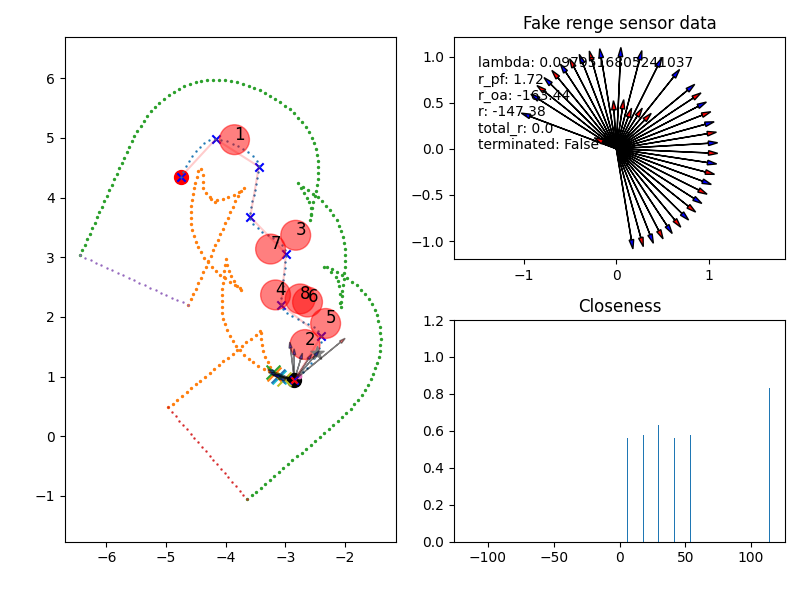

# ATR-RL Guide
I assume your computer already fullfills the environment requirements. For example, you should have installed Gymnasium, numpy, matplotlib, shapely, etc.
If not, find the `requrements.txt` in the same directory as this file, then install all of them. 


## Gymnaisum
For training an agent controls ATR moving in the factory environment, a custom Gymnasium environment is implenmented following this [tutorial](https://gymnasium.farama.org/tutorials/gymnasium_basics/environment_creation/).

Thus you need to install the FactoryENV package first.   
1. Change directory to python_tools
    ```
    cd Code/python_tools
    ```
2. Install FactoryEnv
    ```
    pip install -e FactoryEnv
    ```
3. Test if the environment can be founded
    ```
    cd FactoryEnv/tests
    python is_env_registered.py
    ```
    You should see a plot like this.
    
    You are good to go now.


### Benchmark
Benchmark is for testing how long the reference ATR should take to finish a task. It will print the total steps and total time used.
Assume the length of the reference path is 6m, the maximum linear veloccity of ATR is 0.2m/s. The discrete time step is 0.1s.
Time needed: $t = 6/0.2=30s$. Steps needed: $T = 30/0.1=300$


### Install dependencies
```pip install -r requirements.txt```